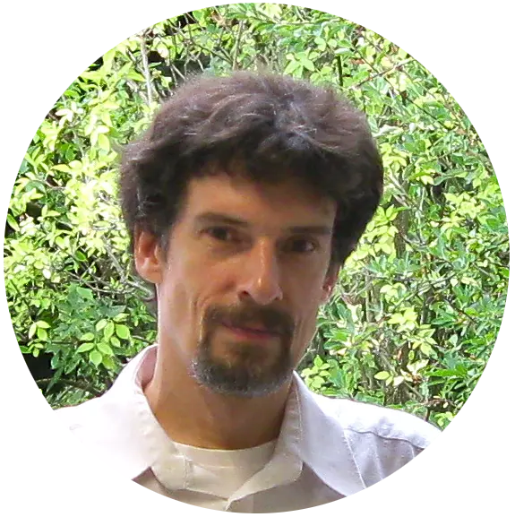

# Christian Jaeger

## Freischaffender Softwareentwickler

mit Erfahrung in verschiedenen Technologien inklusive Scheme, Clojure,
Perl, Python, C, C++, und Rust. <!-- I especially like working in Rust and ..?
which is suitable in a very wide range of contexts. --> Meine Spezialitätenbereiche
sind Backend, Linux-Systeme, Netzwerkdienste, Interpreter,
und GUI-Schnittstellen. Ich kann möglicherweise auch Arbeit im Embedded-Bereich,
Data Science, oder Grafischer Programmierung annehmen.

Wenn möglich und passend publiziere ich die Produkte die ich entwickle
als Open Source Projekte.

Ich habe Erfahrung im Mentoring von Entwicklern.

<!-- ## Environmental background -->

<!-- I have a background in Environmental Sciences, see [Climate & Environment](climate.html). -->

[Kontaktieren Sie mich](/kontakt.html) wenn Sie ein potentielles
Projekt mit mir besprechen möchten.

